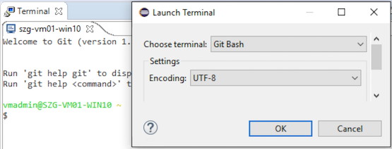
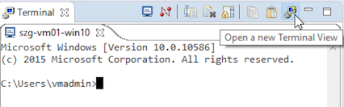

TM/4.1 New & Noteworthy
=======================

< [TM](./TM "TM")

Contents
--------

*   [1 New & Noteworthy for TM 4.1 (RSE 3.7)](#New-.26-Noteworthy-for-TM-4.1-.28RSE-3.7.29)
    *   [1.1 Terminal UI Improvements](#Terminal-UI-Improvements)
    *   [1.2 Terminal API Improvements](#Terminal-API-Improvements)
    *   [1.3 Removed API](#Removed-API)
    *   [1.4 Bug Fixes](#Bug-Fixes)

New & Noteworthy for TM 4.1 (RSE 3.7)
-------------------------------------

### Terminal UI Improvements

Windows 10 Local Terminals are supported with CDT's PTY 8.8 (Mars.1) or later. See [Bug 474327](https://bugs.eclipse.org/bugs/show_bug.cgi?id=474327) for details.

Mac OS X Local Terminals support proper resize and word wrapping with CDT's PTY 9.0 (Neon) or later. See [bug 476709](https://bugs.eclipse.org/bugs/show_bug.cgi?id=476709) for details.

**Git Bash** is now auto-discovered on Windows, and available on the "Open a Terminal (Ctrl+Alt+Shift+T)" dialog. Other custom shells can be configured in the Preferences, Local Terminal, and are then available through the same mechanism. See [bug 460496](https://bugs.eclipse.org/bugs/show_bug.cgi?id=460496) for details.

A **New Terminal View** action has been introduced, for opening an additional view instance. This allows viewing multiple terminals side-by-side, or switching between Terminals in an Eclipse tab folder. This new concept replaces the older "Pinned Terminal" concept, which was unintuitive (see also API removals below).

### Terminal API Improvements

All new API is tagged with @since 4.1 in the source code, noteworthy additions include:

*   Adopters can now **override the terminal title**. See [bug 469415](https://bugs.eclipse.org/bugs/show_bug.cgi?id=469415) for details.
*   Allow **TabFolderManager#getTabCommandFieldHandler** to be overridden. This allows the behavior of the command input field to be changed. See [bug 470854](https://bugs.eclipse.org/bugs/show_bug.cgi?id=470854) for details.
*   Added **ITerminalMouseListener** to the VT100TerminalControl. This allows extensions to implement special features on mouse events, such as clicking on hyperlinks. See [bug 475267](https://bugs.eclipse.org/bugs/show_bug.cgi?id=475267) for details.

### Removed API

*   **ITerminalsView#isPinned()** and **ITerminalsView#setPinned()** have been removed. The "Pinned Terminal" concept for opening additional views had been abandoned very soon after the 4.0 release. So no public use of that deprecated API had been expected. A new command, **org.eclipse.tm.terminal.view.ui.command.newview** has been introduced instead. The _NewTerminalViewAction_ shows how to use that command for programmatically opening a new terminal instance.

### Bug Fixes

See the [4.1.0 release Issues page](https://projects.eclipse.org/projects/tools.tm/releases/4.1.0) for a list of the bugs fixed in this release.

In addition to that, CDT's PTY 9.0 fix for [Bug 491972](https://bugs.eclipse.org/bugs/show_bug.cgi?id=491972) resolves a local terminal issue on some Windows machines ("Not enough storage is available to process this command").

(Migrated from [https://wiki.eclipse.org/TM/4.1_New_%26_Noteworthy](https://wiki.eclipse.org/TM/4.1_New_%26_Noteworthy))