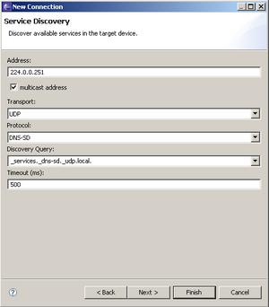
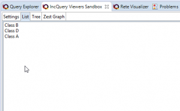

TM Manual Test Plan
===================

Nav: [RSE 1.0 Testing](./RSE_1.0_Testing "RSE 1.0 Testing") | [RSE 1.0 Test Instructions](./RSE_1.0_Test_Instructions "RSE 1.0 Test Instructions") | TM Manual Test Plan

This is the RSE Manual Test Plan. Tasks are outlined very briefly only. Feel free to do some exploratory testing around the suggested items.  
**PLEASE also edit this page yourself** to add test cases you find out by working on RSE.

Contents
--------

*   [1 Standard usability tests](#Standard-usability-tests)
    *   [1.1 Basic Sanity Test](#Basic-Sanity-Test)
    *   [1.2 Update Site](#Update-Site)
    *   [1.3 Drag&Drop, Copy&Paste](#Drag.26Drop.2C-Copy.26Paste)
    *   [1.4 RSE Views](#RSE-Views)
        *   [1.4.1 Collaboration of Views and Refresh](#Collaboration-of-Views-and-Refresh)
    *   [1.5 RSE Widgets & Dialogs](#RSE-Widgets-.26-Dialogs)
    *   [1.6 Preferences](#Preferences)
        *   [1.6.1 Synchronous operation](#Synchronous-operation)
    *   [1.7 Complex Filters](#Complex-Filters)
    *   [1.8 Subsystem Properties](#Subsystem-Properties)
*   [2 Shell / Command View Tests](#Shell-.2F-Command-View-Tests)
    *   [2.1 Shell Program Running](#Shell-Program-Running)
    *   [2.2 Shell Content Assist-Linux](#Shell-Content-Assist-Linux)
    *   [2.3 Shell Content Assist-Windows](#Shell-Content-Assist-Windows)
    *   [2.4 Shell Pattern Matching](#Shell-Pattern-Matching)
*   [3 Dstore specific tests](#Dstore-specific-tests)
    *   [3.1 Dstore Launch Options](#Dstore-Launch-Options)
    *   [3.2 Processes Subsystem](#Processes-Subsystem)
    *   [3.3 Remote Search](#Remote-Search)
*   [4 CDT Remote Launch](#CDT-Remote-Launch)
*   [5 Team Support](#Team-Support)
    *   [5.1 Team Profiles](#Team-Profiles)
*   [6 System Limits and Special Scenarios](#System-Limits-and-Special-Scenarios)
    *   [6.1 Parallel access](#Parallel-access)
    *   [6.2 Scalability](#Scalability)
    *   [6.3 Dirty Editors and Merging](#Dirty-Editors-and-Merging)
    *   [6.4 File Access Permissions and Timestamps](#File-Access-Permissions-and-Timestamps)
    *   [6.5 Connection Problems](#Connection-Problems)
    *   [6.6 File Encodings](#File-Encodings)
*   [7 User and Legal Documentation](#User-and-Legal-Documentation)
    *   [7.1 Verify User Docs](#Verify-User-Docs)
    *   [7.2 Verify Legal](#Verify-Legal)
*   [8 ISV / Code Issues](#ISV-.2F-Code-Issues)
    *   [8.1 Verify Copyright and Externalized Strings](#Verify-Copyright-and-Externalized-Strings)
    *   [8.2 Verify ISV Tutorial](#Verify-ISV-Tutorial)
    *   [8.3 Verify ISV Docs](#Verify-ISV-Docs)
    *   [8.4 Verify Extension Points](#Verify-Extension-Points)
*   [9 Experimental Add-Ons](#Experimental-Add-Ons)
    *   [9.1 EFS](#EFS)
    *   [9.2 Discovery](#Discovery)

Standard usability tests
------------------------

### Basic Sanity Test

*   File Subsystem, dirlist, simple filters, upload/download/edit, Tableview
*   See also [RSE 1.0 Test Instructions#Step 5: Basic Sanity Check](./RSE_1.0_Test_Instructions#Step_5:_Basic_Sanity_Check "RSE 1.0 Test Instructions")

### Update Site

*   Install RSE from the Update Site into plain Eclipse Platform
*   Check that the TM Update Site is added
*   Update features from an update site
*   Add features from an update site

### Drag&Drop, Copy&Paste

*   Check Drag&Drop, Copy&Paste inside the same RSE System
    *   RSE Tree <-> Tree inside the same System (directories, files; overwrite, rename)
    *   RSE Tree Archive (zip,tar,tgz) <-> Tree inside the same System (directories, files; overwrite, rename)
    *   RSE Tree <-> Table or Monitor inside the same Subsystem
    *   RSE Tree/Table/Shell -> Editor
    *   RSE Tree/Table/Shell -> Scratchpad -> Tree/Table/Editor
*   Check Drag&Drop, Copy&Paste crossing RSE Systems
    *   Tree <-> Tree/Table on a different system
    *   Remote <-> Local on Windows and Linux
    *   Remote dstore <-> Remote dstore
    *   Remote dstore <-> Remote ssh
    *   Remote ssh <-> Remote ssh
*   Check Drag&Drop, Copy&Paste RSE <-> Eclipse
    *   RSE Tree (local,dstore,ssh) <-> Eclipse Resource Navigator (directories, files)
    *   RSE Tree (local,dstore,ssh) <-> Eclipse Project Explorer (directories, files)
    *   RSE Tree (local,dstore,ssh) <-> C/C++ Explorer (directories, files)
*   Check Drag&Drop, Copy&Paste RSE <-> OS outside RSE
    *   RSE Tree (local,dstore,ssh) <-> Windows Explorer (directories, files)
    *   RSE Tree (local,dstore,ssh) <-> GNOME Nautilus (directories, files)
    *   RSE Tree (local,dstore,ssh) <-> KDE Konqueror (directories, files)
    *   RSE Tree (local,dstore,ssh) <-> Solaris CDE Desktop (motif: directories, files)
    *   RSE Tree (local,dstore,ssh) <-> MacOS X Finder (directories, files)

### RSE Views

*   Try out all available menu items and fields in the various RSE views:
    *   RSE System view (Tree)
    *   RSE Properties - view and modify
    *   RSE Scratchpad
    *   RSE Tableview - change filtering, sort columns, add/remove columns
    *   RSE Monitor - change update rate, filering, sort columns, add/remove columns
    *   RSE Editor - dbl click various file types
    *   RSE Compare - compare remote files from the same system or different systems

#### Collaboration of Views and Refresh

*   In all cases, modify an item in the remote (file) system and then choose refresh in RSE. Modification may mean rename, delete, add, change properties (e.g. timestamp). See also [bug 181145](https://bugs.eclipse.org/bugs/show_bug.cgi?id=181145)
*   Check that Refresh events are properly reflected in a Table (Remote Systems Details View) and Property Sheet:
    *   Refresh an element in the table -> is it updated in tree and table?
    *   Refresh an element in the tree which is also shown in table -> is it updated?
    *   In the tree, Refresh the parent of an element shown in table -> is it updated?
    *   In the tree, Refresh a grandparent of an element shown in table -> is it updated?

### RSE Widgets & Dialogs

*   Check that all RSE widgets and dialogs that are not part of the perspective itself or the properties directly, work (test all UI elements):
*   Remote file-browse
*   Remote move-to

### Preferences

*   Walk through each of the Preferences and enable/disable them
    *   Check if the outcome is what you expect
*   Are the Preferences documented sufficiently?

#### Synchronous operation

*   Since RSE 2.0M6, the "Deferred Queries" Preference does no longer exist.
*   Use the Local File Subsystem as a showcase of a subsystem with deferred queries disabled: browse into folders, refresh several kinds of (multi) selections, collapsed/expanded folders and leaf nodes. Check [#Collaboration of Views and Refresh](#Collaboration-of-Views-and-Refresh). Verify that there is no "Pending..." node when refreshing an expanded folder.
*   Use a remote SSH or DStore File Subsystem as reference for what happens with deferred queries enabled. Verify that there is a "Pending..." node when refreshing an expanded folder.

### Complex Filters

*   Multiple filter strings
*   Filter by filetype
*   Filter Persistence

### Subsystem Properties

*   Changing Properties of Systems/Subsystems in the RSE Tree
    *   E.g. switch a files subsystem from dstore to ssh and back
    *   What happens to registered filters? Sort order? Connect status?

Shell / Command View Tests
--------------------------

### Shell Program Running

*   Run shell on various slow or fast remote computers, through dstore or ssh
    *   Ensure that all output is printed, and prompt is always visible

Start a program

### Shell Content Assist-Linux

*   Directory and file name completions:
    *   ls te<ctrl+space>
    *   ls /ho<ctrl+space>
    *   ls ../te<ctrl+space>
    *   cat fi<ctrl+space> | grep x
    *   ls $HOME/te<ctrl+space>
    *   ls ~/te<ctrl+space>
    *   check directories with a space in the name (need quoting!)
*   Executable PATH completions
*   Environment variable completions
    *   echo $HO<ctrl+space>

### Shell Content Assist-Windows

*   Directory and file name completions:
    *   dir te<ctrl+space>
    *   dir C:\\Do<ctrl+space>
    *   dir ..\\te<ctrl+space>
    *   type fi<ctrl+space> | grep x
    *   dir %HOME%\\te<ctrl+space>
    *   check MSDOS short form and long form of directory names
    *   check directories with a space in the name (need quoting!)
*   Executable PATH completions
*   Environment variable completions
    *   echo %HO<ctrl+space>

### Shell Pattern Matching

*   Compiler Error Navigation
    *   gcc x.c (allow compiler errors to be printed) -> Check coloring, and editor navigation on dbl click
    *   javac x.java (allow compiler errors to be printed) -> Check coloring, and editor navigation on dbl click
    *   make,nmake,gmake -> check coloring, and editor navigation on dbl click
    *   ./configure -> check coloring, and editor navigation
*   Directory and File Navigation
    *   dir -> Check coloring; check dbl click navigates into directory
    *   ls -> Check coloring; check dbl click navigates into directory
    *   ls -l -> Check coloring; check dbl click on file into editor;
    *   check drag&drop of files into editor, directories into RSE tree
*   Other commands
    *   grep -n something * --> check coloring and dbl click navigation into editor
    *   ps -> Check coloring
    *   env -> Check coloring
    *   find . -name xx --> check editor navigation

Dstore specific tests
---------------------

### Dstore Launch Options

*   In the New Connection Wizard, try the various Launcher options for dstore:
*   Daemon:
    *   Try daemon on Windows, Linux, Unix, AIX, Mac
    *   Try port ranges
    *   What happens if daemon is not running, or behind a firewall
*   RExec:
    *   What happens if remote path to server is wrong
    *   Check incorrect JVM is installed on remote (e.g. 1.3) or not found (PATH)
*   Running:
    *   Connect to running server
    *   What if the running server is already connected to a different user
*   SSL:
    *   Set up an SSL-encrypted connection

### Processes Subsystem

*   List, Sort, Kill, Remote Monitor

### Remote Search

*   Select a remote folder, right-click > Search: Should search from selected folder down
*   Try all options in the remote search dialog
*   Do various dstore actions, e.g. open-editor, kill-process while a remote search is running

CDT Remote Launch
-----------------

*   Try all GUI elements in the CDT Remote Launch Configuration
*   Try with ssh and dstore connection types
*   Try full debugging; check I/O on the debuggee's shell
*   Try Linux X Linux and Windows X Linux scenarios
*   What happens if the gdbserver port is already in use
*   What happens if the remote file path does not exist or is not writable (permissions)
*   Try programs with shared libraries

Team Support
------------

*   Share connections as documented in user docs
*   Import connections into a different workspace

### Team Profiles

*   Duplicate/Move RSE Objects to Profile
*   Check Persistency

System Limits and Special Scenarios
-----------------------------------

### Parallel access

*   Do multiple parallel actions very quickly
    *   Download files in background while opening editor
    *   Do dstore archive access while opening editor
    *   Do Remote Monitor Processes with very short update interval while doing something else

### Scalability

*   Open directories with LOTS of files
*   Open really huge archives, browse them and copy files out of them
*   Run the Remote Monitor with lots of events
*   Check download & cancel for really large files

### Dirty Editors and Merging

*   Edit a remote file from multiple connections (ssh and dstore)
*   Check various answers to the "conflict" dialog

### File Access Permissions and Timestamps

*   Create files, directories and symbolic links on remote side
    *   Denied read access, write access, executable access or all of them
    *   Symbolic links pointing to inaccessible files or directories
    *   Broken symbolic links pointing to nowhere
        *   Named like archives, text files
        *   Try dbl clicking them, downloading them, choosing them as target for copy&paste, drag&drop
*   Check timestamp of remote files in RSE properties (on dstore, ssh, ftp connections)

### Connection Problems

*   Test very slow connections
*   Test unavailable/unreliable hosts
*   Test timeouts
*   Test breaking existing connections, e.g. by removing a network cable

### File Encodings

*   Check foreign language files on remote side

User and Legal Documentation
----------------------------

### Verify User Docs

*   Walk through tutorial, Context Help, Check Links, Search feature

### Verify Legal

*   Feature Descriptions, Licenses in all source features, Overall license

ISV / Code Issues
-----------------

### Verify Copyright and Externalized Strings

*   Run automated checks, chkpii

### Verify ISV Tutorial

*   Walk through ISV tutorial

### Verify ISV Docs

*   Broken Links, Semantic correctness, Searchable docs, Useful Javadoc

### Verify Extension Points

*   Check docs, use in own code

Experimental Add-Ons
--------------------

### EFS

*   New > Project > General > Project, select a directory on an RSE File System
    *   Check the Browse button, or entering an URN directly
    *   Check the resulting project: create files or folders, edit & save them, move
*   In RSE, select a directory and choose Contextmenu > Create Remote Project

### Discovery

*   The service discovery package uses an EMF model to store the data, so EMF 2.2.0 or later has to be installed before using it.

*   To use service discovery it is necessary to have a remote DNS-SD compliant server advertising the available services. DNS-SD servers may also be known as Zeroconf-Avahi-Bonjour-Rendezvous. More information about it can be found at [dns-sd.org](http://www.dns-sd.org/)

*   If the target machine runs Windows, you can use [Apple Bonjour for Windows](http://a1408.g.akamai.net/7/1408/9955/20060417/akamai.info.apple.com/Bonjour/061-2389.20060417.bnjr3w/BonjourSetup.exe) and the [Apple Bonjour SDK for Windows](http://developer.apple.com/networking/bonjour/BonjourSDKSetup.exe). The SDK contains a sample application called dns-sd.exe that allows advertising services using the following syntax:

    dns-sd.exe -R ServiceName _serviceid._transport . port keyA=valueA keyB=valueB ...

*   As an example, advertising a FTP server (\_ftp.\_tcp) called MyFTP running on port 21 with some keys/values would be:

    dns-sd.exe -R MyFTP _ftp._tcp . 21 key1=value1 key2=value2

*   The supported services and transports have to be advertised as:

  

| Advertised server ... | Creates in RSE... |
| --- | --- |
| \_daytime.\_tcp | Daytime client (example plugin) |
| \_ssh.\_tcp | SSH client |
| \_sftp-ssh.\_tcp | SFTP client |
| \_ftp.\_tcp | FTP client |
| \_dstore-proc.\_tcp | Dstore Processes client |
| \_dstore-shell.\_tcp | Dstore Shell client |
| \_dstore-files.\_tcp | Dstore Files client (target not Windows) |
| \_dstore-files-w.\_tcp | Dstore Files client (target Windows) |

  

*   Once the remote server is set up, install the RSE Target Management plugins. Those are not part of the core plugins, they are distributed as an Add-On and require EMF v2.2.0

*   Start RSE and got to File -> New -> Remote System Explorer -> Connection. It should bring the "New Connection Wizard". "Discovery" should be listed as one of the systems. Select it and press "Next"

*   The only available and selected protocol and transport are DNS-SD and UDP. Those should be selected by default. A timeout of 500 ms is also set by default, increase it if necessary, but it should be engouh. As address, specify the mDNS multicast address **224.0.0.251** or the target IP address or server name (that will be resolved) if preferred.

[Enlarge](./images/Discovery.png)

Service Discovery form

*   Press next and the discovered services should appear in an expandable tree, showing the service names and attributes grouped by host and service type. The remote service attributes will be shown in a table when selected. The discovered attributes can be overwritten in the table. Initially, only supported servers will appear, if you want to show also the non-supported ones (if any available), select the "Show all services" check box. Only supported services will be created in RSE.

[Enlarge](./images/List.png)

Discovered Services

*   After selecting the desired services, press "Finish". A list of new systems called "Discovery@10.23.12.21" (being 10.23.12.21 the remote server IP) should appear per each discovered host containing the services.

*   The port specified in the discovery server should appear as the one that the service uses, and it should have a set of properties labeled "Discovery" containing the discovered keys and values.

*   The created services (ftp, ssh...) should work without more configuration, prompting the username-password dialog and connecting to the remote server.

  
**Known issues and workarounds**

  

| Bug | Description |
| --- | --- |
| [Bug 174495](https://bugs.eclipse.org/bugs/show_bug.cgi?id=174495) | Two or more subsystems of the same kind cannot be added to the same host. Adding more than one "File" services such as sftp + ftp will only create one "File" instance (but duplicated). After restarting only one is shown. |

(Migrated from [https://wiki.eclipse.org//TM_Manual_Test_Plan](https://wiki.eclipse.org//TM_Manual_Test_Plan))