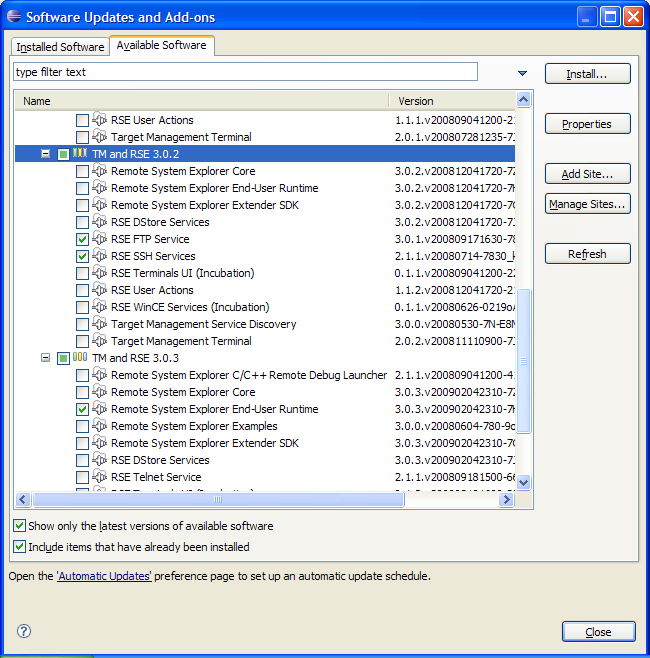

TM and RSE FAQ
==============

Nav: [TM](./TM "TM") | TM and RSE FAQ | [RSE 1.0 Known Issues and Workarounds](./RSE_1.0_Known_Issues_and_Workarounds "RSE 1.0 Known Issues and Workarounds") | [TM 2.0 Known Issues and Workarounds](./TM_2.0_Known_Issues_and_Workarounds "TM 2.0 Known Issues and Workarounds") | [TM/3.0 Known Issues and Workarounds](./3.0_Known_Issues_and_Workarounds "TM/3.0 Known Issues and Workarounds")

Contents
--------

*   [1 Introduction](#Introduction)
    *   [1.1 How do I contribute to this FAQ?](#How-do-I-contribute-to-this-FAQ.3F)
    *   [1.2 How can I get notified of additions to that FAQ?](#How-can-I-get-notified-of-additions-to-that-FAQ.3F)
    *   [1.3 Is it really that easy?](#Is-it-really-that-easy.3F)
*   [2 General](#General)
    *   [2.1 What is the Target Management Project?](#What-is-the-Target-Management-Project.3F)
    *   [2.2 What is RSE?](#What-is-RSE.3F)
    *   [2.3 So what is the difference between TM and RSE?](#So-what-is-the-difference-between-TM-and-RSE.3F)
    *   [2.4 How is TM / RSE licensed?](#How-is-TM-.2F-RSE-licensed.3F)
    *   [2.5 How do I find out about future releases of TM / RSE?](#How-do-I-find-out-about-future-releases-of-TM-.2F-RSE.3F)
    *   [2.6 Is the TM Project also working on a lightweight Open Source Agent framework in C?](#Is-the-TM-Project-also-working-on-a-lightweight-Open-Source-Agent-framework-in-C.3F)
*   [3 Download, Installation and Bug Reports](#Download.2C-Installation-and-Bug-Reports)
    *   [3.1 Which TM build should I download?](#Which-TM-build-should-I-download.3F)
    *   [3.2 Where can I find TM / RSE using the Install/Update Manager from a Discovery Site?](#Where-can-I-find-TM-.2F-RSE-using-the-Install.2FUpdate-Manager-from-a-Discovery-Site.3F)
        *   [3.2.1 Europa](#Europa)
        *   [3.2.2 Helios](#Helios)
    *   [3.3 What components do I have to install for working with a remote file system?](#What-components-do-I-have-to-install-for-working-with-a-remote-file-system.3F)
    *   [3.4 Which operating systems does TM / RSE support?](#Which-operating-systems-does-TM-.2F-RSE-support.3F)
    *   [3.5 How do I ask questions?](#How-do-I-ask-questions.3F)
    *   [3.6 How do I report a bug or request a feature?](#How-do-I-report-a-bug-or-request-a-feature.3F)
    *   [3.7 Where is this .log file that I hear so much about?](#Where-is-this-.log-file-that-I-hear-so-much-about.3F)
    *   [3.8 How do I report a deadlock or product hang-up?](#How-do-I-report-a-deadlock-or-product-hang-up.3F)
*   [4 Working with TM / RSE as a User](#Working-with-TM-.2F-RSE-as-a-User)
    *   [4.1 How can I use a remote workspace over SSH?](#How-can-I-use-a-remote-workspace-over-SSH.3F)
    *   [4.2 Why is the Outline View empty when editing a remote PHP or C file?](#Why-is-the-Outline-View-empty-when-editing-a-remote-PHP-or-C-file.3F)
    *   [4.3 How can I do Remote Debugging with CDT?](#How-can-I-do-Remote-Debugging-with-CDT.3F)
    *   [4.4 Why can't I connect to the dstore server? I get disconnected after entering my user and password](#Why-can.27t-I-connect-to-the-dstore-server.3F-I-get-disconnected-after-entering-my-user-and-password)
    *   [4.5 Why can't I connect to my dstore server started with server.sh?](#Why-can.27t-I-connect-to-my-dstore-server-started-with-server.sh.3F)
*   [5 Working on TM / RSE](#Working-on-TM-.2F-RSE)
    *   [5.1 How do I debug a problem with TM / RSE?](#How-do-I-debug-a-problem-with-TM-.2F-RSE.3F)
    *   [5.2 How do I use eclipse to develop Target Management plugins?](#How-do-I-use-eclipse-to-develop-Target-Management-plugins.3F)
    *   [5.3 How do I build RSE from CVS if I want a more recent build than is on the downloads page?](#How-do-I-build-RSE-from-CVS-if-I-want-a-more-recent-build-than-is-on-the-downloads-page.3F)
    *   [5.4 How do I apply a patch?](#How-do-I-apply-a-patch.3F)
    *   [5.5 How do I modify the code?](#How-do-I-modify-the-code.3F)
    *   [5.6 How do I run or debug with my changes?](#How-do-I-run-or-debug-with-my-changes.3F)
    *   [5.7 How do I export it so that it can be used with an external Eclipse installation?](#How-do-I-export-it-so-that-it-can-be-used-with-an-external-Eclipse-installation.3F)
    *   [5.8 How do I submit a fix for a bug?](#How-do-I-submit-a-fix-for-a-bug.3F)
    *   [5.9 How do I submit a contribution beyond a simple bug fix?](#How-do-I-submit-a-contribution-beyond-a-simple-bug-fix.3F)
    *   [5.10 How do I distribute my changes to my customers?](#How-do-I-distribute-my-changes-to-my-customers.3F)
*   [6 TM and RSE Architecture](#TM-and-RSE-Architecture)
    *   [6.1 How can I understand the RSE architecture and learn programming on it?](#How-can-I-understand-the-RSE-architecture-and-learn-programming-on-it.3F)
    *   [6.2 What is the difference between RSE IFileService and EFS?](#What-is-the-difference-between-RSE-IFileService-and-EFS.3F)

Introduction
------------

#### How do I contribute to this FAQ?

Simply edit this page and add content. You can now use your [bugzilla](https://bugs.eclipse.org/bugs/) username and password to gain access.

#### How can I get notified of additions to that FAQ?

Log in to the Wiki. On your personal [Preferences](https://wiki.eclipse.org/Special:Preferences "Special:Preferences") page, enable E-Mail notification. Then, click the **watch** tab of this page.

#### Is it really that easy?

Yes!

General
-------

#### What is the Target Management Project?

It's all about remote computer systems (targets, hosts, boards, grids, farms, nodes...) and developing software on them: remote build, connect, get status, download, run, debug, ...

Since there are many different vendors and solutions around for remote access and especially in the device software space, the main charter of target management is to provide data models and frameworks that are flexible and open enough for vendor-specific extensions. But TM is not limited to device software at all - it can also be used for remote grid or mainframe operations. In fact, the things to be done are often similar, just the terminology is different. Sample implementations are being provided for TCP/IP connections, FTP data transfer and gdb remote launching in the CDT environment. The basis for our implementations is the Remote System Explorer (RSE).

Apart from the Extender's perspective, TM and RSE is also a toolkit that can be used out of the box: a framework, widgets and tools to manage remote systems under a single, consistent user interface.

*   For a more official answer, see the

[Target Management Project Homepage](https://www.eclipse.org/tm/about.php).

*   For an excellent document we prepared when the project was started (but is still fully correct!) on the terminology we choose and the whole list of use cases we want to address in the long term, see the [TM Use Cases Document](https://www.eclipse.org/tm/doc/TM_Use_Cases_v1.1c.pdf).

*   The [EclipseCon 2007 Short Talk](http://www.eclipsecon.org/2007/index.php?not_accepted=0&page=sub/&id=3781&conference=2007) slides give a good quick overview of the project. PPT slides include comments with additional explanations.

#### What is RSE?

The Remote System Explorer (RSE) is a consistent framework and UI for accessing remote computer resources from Eclipse.

#### So what is the difference between TM and RSE?

The Target Management Project works in two repositories:

*   org.eclipse.tm.core - Core Components for remote access that can be re-used without other dependencies. Currently, these include Jakarta Commons/Net, Zeroconf Discovery and a Terminal view.
*   org.eclipse.tm.rse - The Remote System Explorer (RSE).

We are delivering RSE for download, which integrates some (but currently not all) core components into a consistent framework and UI. TM is the "project", RSE is the "product".

#### How is TM / RSE licensed?

RSE consists of software produced by the TM / RSE team combined with third party software developed from other Open Source Projects. The software produced by the TM / RSE team is licensed under the [Eclipse Public License (EPL)](https://www.eclipse.org/legal/epl-v10.html). The software designed by third parties is made available under their respective licenses. Refer to the about.html file in the root directory of every RSE plugin for specific licensing information.

#### How do I find out about future releases of TM / RSE?

See the [TM Project Plan Page](http://eclipse.org/tm/development/plan.php).

If you wish to contribute to the development of RSE, we welcome the opportunity to work with you. The plans will be updated to reflect the commitments made by contributors to this projects. See [#Working on RSE](#Working-on-RSE) for information on how to get started.

#### Is the TM Project also working on a lightweight Open Source Agent framework in C?

*   Yes! An initial contribution of the [Target Communication Framework (TCF)](https://wiki.eclipse.org/TCF "TCF") has been made by Wind River and is currently pending Eclipse Legal IP Review via [bug 210751](https://bugs.eclipse.org/bugs/show_bug.cgi?id=210751). While dstore will remain the Java-based agent framework for large, powerful targets, TCF is a small footprint, very lightweight agent framework for less powerful embedded systems.
*   A [PPT presentation on TCF Concepts and Requirements](https://www.eclipse.org/downloads/download.php?file=/tm/presentations/Target_Communication_Framework_Vision_v4.ppt) is now available (PPT, 500K)
*   For more details, see the [TCF](https://wiki.eclipse.org/TCF "TCF") FAQ.

Download, Installation and Bug Reports
--------------------------------------

#### Which TM build should I download?

The latest stable release version is available from the [TM downloads page](http://download.eclipse.org/tm/downloads).

#### Where can I find TM / RSE using the Install/Update Manager from a Discovery Site?

##### Europa

All components of TM are available for download under _Remote Access and Device Development_ in the Install/Update manager. The specific downloads from TM under this category are:

*   Remote Systems Explorer End-User Runtime
*   Remote Systems Explorer Extender SDK
*   Remote Systems Explorer C/C++ Remote Debug Launcher
*   Target Management Terminal
*   Target Management Service Discovery

Remote Systems Explorer C/C++ Remote Debug Launcher and TM Service Discovery require additional plug-ins. When downloading these components make sure to click "Select Required" to get the additional plug-ins.

##### Helios

The components of TM available for download in the Install/Update manager are:

(Categories are given in parentheses following each entry)

*   Remote System Explorer Core (RSE_Runtime)
*   Remote System Explorer End-User Runtime (General Purpose Tools; Mobile and Device Development; TM and RSE Main Features)
*   Remote System Explorer Extender SDK (TM and RSE Main Features)
*   C/C++ Remote Launch (CDT Optional Features; Mobile and Device Development)
*   Target Management Terminal (Mobile and Device Development; TM and RSE Main Features)
*   Target Management Service Discovery (TM and RSE Optional Add-Ons)

Also available:

*   Remote System Explorer Examples (RSE_SDK; TM and RSE Optional Add-Ons)
    
    Note that the RSE_SDK version is much older than the TM and RSE Optional Add-Ons one
    
*   Remote System Explorer SDK (RSE_SDK)
    
    Old version, incompatible with the current TM and RSE features
    
*   Remote System Explorer User Actions (TM and RSE Main Features)
*   RSE CDT Remote Launcher (Target Management Add-Ons)
    
    This is a Launch Configuration for debugging C/C++ programs on a remote host through RSE-provided shell and file services
    
*   Dynamic Languages Toolkit - Remote Development Support (General Purpose Tools)
    
    This provides Remote Development Support via RSE for DLTK-based IDEs
    
*   PTP Remote System Explorer Adapter (General Purpose Tools; Parallel Tools Platform)
    
    RSE adapter for PTP (Parallel Tools Platform)
    

**Note:** The packages libssl-dev and uuid-dev must be installed for the org.eclipse.tm.tcf.agent plug-in to compile properly.

#### What components do I have to install for working with a remote file system?

If your need is to browse and manipulate a remote file system from within eclipse, this is what you at least need to install:

*   RSE System Explorer End-User runtime

Further, you need to install features for the type of communication you want to use

*   RSE FTP service
*   RSE SSH service

_Note:_ Version 3.2.1 apparently subsumes a lot of the components shown below into its core; they are no longer visible.

The update site shows multiple version branches. For each component, try to install the latest version. You can mix components of different versions:

#### Which operating systems does TM / RSE support?

The RSE Framework is platform independent. It will run where Eclipse will run. According to the [TM Project Plan](https://www.eclipse.org/tm/development/plan.php), we are testing on a set of [Reference Platforms](https://www.eclipse.org/dsdp/tm/development/plan.php#OperatingEnvironments) including Windows, Linux, MacOS X and Solaris.

For the remote side, we are testing the following combinations:

*   The remote dstore agent is being tested on Windows, Linux and Solaris but should also run fine on any OS that supports a Java 1.4 VM or later. There are known implementations on AIX, OS/390, and z/OS.
*   FTP is being tested against many public available servers including Windows, Linux, FileZilla, ProFTPD, and VxWorks. VMS based servers are known to have problems [bug 161238](https://bugs.eclipse.org/bugs/show_bug.cgi?id=161238).
*   Ssh works against any ssh2 compliant server.

See also the test matrix on the [TM 2.0 Testing](./TM_2.0_Testing "TM 2.0 Testing") pages and below.

If you are using on a platform not mentioned here, please make yourself heard on the [tm-dev](http://dev.eclipse.org/mailman/listinfo/tm-dev) developer mailing list. You can contribute test results there.

If you have a favorite platform we highly encourage you to get involved and volunteer to own a feature that does not currently have an implementation that works on your platform of choice. See [#Working on RSE](#Working-on-RSE) for more information.

#### How do I ask questions?

Target Management and RSE related questions that are not answered in this FAQ or the documentation should be posted to the [TM public forum](https://www.eclipse.org/forums/eclipse.tm). Instead of the web interface, you can also use the forums via NNTP - then you will need a [newsreader and a password](https://wiki.eclipse.org/Webmaster_FAQ#Getting_the_news.2C_reading_the_mail "Webmaster FAQ").

General Questions about the Eclipse SDK which includes the [Eclipse Platform](https://www.eclipse.org/platform), [JDT](https://www.eclipse.org/jdt) (Java Development Tools), or [PDE](https://www.eclipse.org/pde) (Plugin Development Environment) should be posted to the respective [Eclipse forum](https://www.eclipse.org/forums/) (consider the Newcomer forum).

Keep in mind that these newsgroups are public, so do not include any confidential information in your questions. You should also read ["How to ask questions the smart way"](http://www.catb.org/~esr/faqs/smart-questions.html) by Eric Raymond before participating in the newsgroups. NOTE: Please submit bugs to [bugzilla](http://dev.eclipse.org/bugs), not to the newsgroups. [#How do I report a bug or request a feature?](#How-do-I-report-a-bug-or-request-a-feature.3F) section of this document.

People will still come into a newsgroup asking questions that have been answered before and often will not provide any information about what versions they have installed, and what the problem is. You will be much more likely to get help if you provide enough information to reproduce the problem. The section on [#How do I report a bug or request a feature?](#How-do-I-report-a-bug-or-request-a-feature.3F) gives a list of some information which could be useful.

#### How do I report a bug or request a feature?

The Target Management Project and RSE (like the Eclipse Project) uses [bugzilla](http://www.bugzilla.org/) as its bug and feature tracking system. You can very easily [file a bug](https://bugs.eclipse.org/bugs/enter_bug.cgi?product=Target%20Management&version=unspecified&component=RSE) against Target Management. Around, this, we have developed some queries and best practices on the [TM Bug Process Page](https://www.eclipse.org/tm/development/bug_process.php).

Entering a bug/feature report is as simple as [filling in a web form](https://bugs.eclipse.org/bugs/enter_bug.cgi?product=Target%20Management&version=unspecified&component=RSE). The first time you enter a bug you will need to [create a new bugzilla account](http://dev.eclipse.org/bugs/createaccount.cgi) for yourself by providing an email address and choosing a password.

Entering a bug report or enhancement request is **really simple**, and we encourage users to just go ahead and do it so the request gets tracked. If, on the other hand, you prefer to first search if a similar bug has been reported before, just use the [bugzilla search form](http://dev.eclipse.org/bugs/query.cgi). The [TM Bug Process Page](https://www.eclipse.org/tm/development/bug_process.php) also has some pre-defined queries that you can modify (just press the "Edit this search" link after running the query). If you find a bug report that outlines the problem you are seeing, you can simply annotate it with your comments to let the developers know that you have also hit the bug. Also you can add yourself to the CC list of the bug so that you will notified when the status of the bug changes or someone adds comments.

Once you have searched bugzilla and not found anything, you can go ahead and enter a new bug report. Don't let yourself be constrained too much by the [bug writing guidelines](http://dev.eclipse.org/bugzilla.html). Following these is helpful for us but not an absolute must. Fill in what's easily accessible for you from the following:

Environmental settings:

1\. The build level of Eclipse that you are using. For example, "Eclipse 3.2.1"

2\. The build level of TM that you are using. For example, "TM 1.0 build I20061104"

3\. Your computer's specifications (OS version + patch level, memory, other pertinent info)

4\. The contents of your .log file (or lack thereof). This is especially important if you get a dialog that reports an internal error. See [#Where is this .log file I hear so much about?](#Where-is-this-.log-file-I-hear-so-much-about.3F) for information on finding your .log file.

5\. The Java runtime or development kit you are using to run eclipse (use java -version or java -fullversion)

Problem Description:

1\. A description of what you were doing,

2\. A description of what behavior that you observed, and

3\. An explanation of how the observed behavior differs from the expected behavior

Note that once you have filled in your environmental settings in one bug report, you can "Remember values as bookmarkable template" in bugzilla to easily file your next bug report on the same computer the next time.

#### Where is this .log file that I hear so much about?

The .log file is located in the workspace/.metadata directory.

The .log file is used by the Eclipse Platform to log runtime errors. It is useful to include it in bug reports because it contains stack traces that occur in plug-ins.

You can also see the .log file in Eclipse from **Help > About > Configuration Details > View Error Log** or, if you have installed eclipse-SDK (with JDT and PDE) from **Window > Show View > Other > PDE Runtime > Error Log**.

When you report a bug, including backtraces or error info from your .log is tremendously helpful! If you see multiple backtraces that seem to be related to your problem, it's best to just go and attach your entire .log file to the bug.

#### How do I report a deadlock or product hang-up?

The most important thing in case of a product hang-up is getting a **thread dump** of Eclipse while it is unresponsive. There are several tools available that help you creating one, see [How to report a deadlock](https://wiki.eclipse.org/How_to_report_a_deadlock "How to report a deadlock").

When you have the thread dump, [file a bug](https://bugs.eclipse.org/bugs/enter_bug.cgi?product=Target%20Management&version=unspecified&component=RSE) against Target Management with high severity, and attach the thread dump.

If you want to seriously debug the issue, see [#How do I debug a problem with TM / RSE?](#How-do-I-debug-a-problem-with-TM-.2F-RSE.3F) below.

Working with TM / RSE as a User
-------------------------------

#### How can I use a remote workspace over SSH?

There are multiple possibilities:

1\. **Run Eclipse on the remote machine** and use it rhough a [VNC](http://en.wikipedia.org/wiki/VNC) session or [RDP (NX client)](http://www.nomachine.com/download.php) or through a local X server.

*   **Advantages**: Working fully in the remote environment, all remote tools are available.
*   **Disadvantages**: Need Eclipse installed on remote, which is not possible on some platforms, as well as a VNC or NX server. VNC works fine also on relatively slow connections, NX client works even better thanks to caching; X forwarding requires a very fast connection with low latency to run Eclipse, even a 10MBps Ethernet is sometimes too slow.

2\. **Use an OS driver to map the remote file system** to local, e.g [SSHFS](http://de.wikipedia.org/wiki/SSHFS) or [\[1\]](http://de.wikipedia.org/wiki/Samba_%28Software%29) if you can. Note that if you think that your server would support file system mounting but you don't have a client, you can consider virtualization e.g. with the free [VMWare Player](http://www.vmware.com/download/player/) and the free [Ubuntu Appliance](http://www.vmware.com/appliances/directory/954), or using [VirtualBox](http://www.virtualbox.org/)

*   **Advantages**: Transparent access to the remote, all Eclipse based tools available just as local.
*   **Disadvantages**: Need the rights to install file system drivers; need fairly fast network access to work properly in the Resource system. Some remote tools might not be available locally. In a Windows X UNIX Cross scenario, different paths (drive letter on windows) might cause problems when dumping generated files e.g. CDT Makefiles.

3\. **Use rsync to sync the remote workspace to the local machine**, work on it, and rsync it back to the remote when done. RSync comes pre-installed on most Linux machines, is available in [Cygwin](http://cygwin.redhat.com) for Windows or you can use the [DeltaCopy](http://www.aboutmyip.com/AboutMyXApp/DeltaCopy.jsp) installable wrapper on Windows.

*   **Advantages**: fast local access to all files, static analysis with parsers works fine; supports offline editing on a Laptop and syncing back later
*   **Disadvantages**:
    *   tools which are only available on the remote cannot be used
    *   updates can only be previewed after syncing back with rsync, which is problematic when e.g. working on a remote website that should be previewed as you edit
    *   approach is problematic when the workspace is huge and only few files need to be looked at
    *   problematic when multiple users work on the remote workspace at the same time (merge issues)

4\. **Use [RSE](https://www.eclipse.org/tm) to transparently edit** remote files

*   **Advantages**: directly editing on the remote, minimal data transfer (works fine on slow connections), provides immediate preview, no merge issues and remote tools are available remotely
*   **Disadvantages**: since local Eclipse tooling like CDT, PDT, Web Tools etc are not aware of the remote files being edited in RSE, static analysis / parsers do not work (see also the [next FAQ entry](#Why-is-the-Outline-View-empty-when-editing-a-remote-PHP-or-C-file.3F))

5\. **Use the [RSE EFS Provider](http://tmober.blogspot.com/2007/04/target-management-m6-efs-and-webinar.html)** to make the remote resources transparently available to Eclipse as Workspace Resources. Not all Eclipse tooling is properly aware of EFS yet; gives some background. Also, [bug 181460](https://bugs.eclipse.org/bugs/show_bug.cgi?id=181460) is open against RSE because purely remote projects (i.e. where the .project file is on the remote, and should be shared through EFS) fail to open automatically on Eclipse startup. Still, [Kevin Doyle blogged](http://rseworld.blogspot.com/2007/12/how-rse-has-changed-way-i-do-school.html) about using the EFS approach over RSE to do remote school work as a student with JDT, and it's been working fine for him.

*   **Advantages**: direct editing on the remote, provides immediate preview, no merge issues and remote tools are available remotely
*   **Disadvantages**:
    *   Very slow refresh when the remote file tree is huge on a slow connection. Since EFS maps the entire remote file tree into the workspace, and the Eclipse Workspace wants to do a "deep refresh" on all remote resources on startup, refresh can easily take in the range of hours on a slow connection. [bug 219164](https://bugs.eclipse.org/bugs/show_bug.cgi?id=219164) is open to track this situation, but it's unlikely this can be improved unless some APIs are broken in the way the Resources system works.
    *   Not all Eclipse tools support EFS yet (see [this newsgroup posting](http://dev.eclipse.org/newslists/news.eclipse.dsdp.tm/msg00307.html) for some background). Currently, Eclipse Platform, PDT and WST should work fine while CDT is still struggling, see [bug 177994](https://bugs.eclipse.org/bugs/show_bug.cgi?id=177994).
    *   On fully remote projects (when the .project file is remote), the RSE EFS provider currently cannot automatically re-open the project on Eclipse startup. [bug 181460](https://bugs.eclipse.org/bugs/show_bug.cgi?id=181460) is open against RSE for this problem, but it's hard to fix; [alternative EFS providers](https://wiki.eclipse.org/EFS "EFS") could be used to overcome this problem. The [PTP/planning/remote](https://wiki.eclipse.org/PTP/planning/remote "PTP/planning/remote") Wiki summarizes the PTP project's efforts in this area.

6\. **Use Remote file synchronization with PTP Synchronized Projects or Aptana Studio**

*   See [here for PTP Synchronized Projects](https://wiki.eclipse.org/PTP/sync-projects) or [this Forum Post for Aptana Studio](https://www.eclipse.org/forums/index.php?t=msg&S=d09f3048f6ad146b90fb5f00aee21fa1&th=202841&goto=648459#msg_648459)

**Summing up**, I would recommend the following (in order of preference):

1\. VNC or NX when available remotely, Eclipse can be started remotely and the network is fast enough (try it out).

2\. Mounted filesystem (Samba or SSHFS) when possible, the network is fast enough and the workspace is not too huge.

3\. rsync when offline editing is desired, sufficient tooling is available locally, and no merge issues are expected (single user scenario).

4\. RSE on very slow connections or huge workspaces where minimal data transfer is desired.

5\. EFS on fast connections when all tooling supports it, and options like VNC or mounted filesystem or rsync are not available.

#### Why is the Outline View empty when editing a remote PHP or C file?

PHPEclipse prior to version 1.2.0 and CDT need a project context in order to fill the outline view. Remote Files accessed through RSE are not associated with any particular project, so they are treated as "external files" and don't have a PHP or CDT personality attached.

If you want full tooling support for remote files, you should try setting up the remote files through EFS.

For PDT, which is based on the WST editor framework, this should work properly since the Europa Fall Maintenance release (28 Sep 2007). It would work as follows:

*   Create a new local PDT project (initially empty)
*   New > Folder > Advanced > Link to Folder in File System > Deselect default, select RSE File System > Browse to Remote Folder

For PHPEclipse update to version 1.2.0 or greater.

*   Create a new PHPEclipse project (give project a name)
*   Deselect the "Use default location"
*   Change "Choose file system" to RSE
*   Click browse and select a existing RSE location or create a new one.
*   Click finish

As of Eclipse Europa, only few tooling projects support EFS, but support is growing. For more details, see the [EFS](https://wiki.eclipse.org/EFS "EFS") Wiki page. CDT, particularly, does not yet support remote EFS resources properly, see [bug 177994](https://bugs.eclipse.org/bugs/show_bug.cgi?id=177994). We suggest filing similar bug reports against other Eclipse based tools to make them more aware of EFS and external files without project context.

An [update on the EFS situation](http://dev.eclipse.org/newslists/news.eclipse.dsdp.tm/msg00307.html) has been posted on the eclipse.tm newsgroup.

#### How can I do Remote Debugging with CDT?

There is two very different kinds of setup for remote debugging:

1\. Have the Debugger run on the remote system, and

2\. Have the Debugger run on the local system, as a cross debugger, with some kind of thin agent on the remote.

The first, **"remote debugging"** case, can be addressed with CDT alone: typically, compilation will happen on the remote host, and all tools need to be available remotely including the debugger. An NFS or Samba mount can be used to make the remote sources visible locally for static analysis and editing. The make command is changed into "ssh remotehost make -C remoteDir" and the debug command is changed into "ssh remotehost gdb". See [bug 30094 comment 13](https://bugs.eclipse.org/bugs/show_bug.cgi?id=30094#c13) for more info. There are at least two open bug that prevent this form of remote debugging from working out-of-the-box in CDT 5.0, 6.0 and 7.0: [305449](https://bugs.eclipse.org/bugs/show_bug.cgi?id=305449) and [252758](https://bugs.eclipse.org/bugs/show_bug.cgi?id=252758).

For the second, **"cross debugging"** case, there are multiple options but they all have one prerequisite in common: you need a cross toolchain installed locally. That is, your compiler runs locally (e.g. on Windows) and produces output that the remote (e.g. Linux) system can execute. Similarly, your debugger runs locally (e.g. gdbppc) and is capable of debugging the remote system. Such a cross toolchain is available from commercial vendors, or you can build one yourself. See [Wikipedia:Cross-compilation](http://en.wikipedia.org/wiki/Cross-compilation) for a starting point.

When you have your cross toolchain set up (and tested on the commandline), you can start integrating it into Eclipse. There's multiple options for this:

1\. Use the [Target Management](https://www.eclipse.org/tm) / RSE Remote CDT Launch. It uses any RSE file subsystem and shell subsystem, so it works with SSH, Telnet, FTP or whatever communication mechanism you have plugged into RSE. It requires a gdbserver executable installed on the remote, and is capable of uploading your executable to debug to the remote. Here is a [mailing list entry](http://dev.eclipse.org/mhonarc/lists/dsdp-tm-dev/msg01431.html) that should help you get started.

2\. Use the [Device Debugging](https://www.eclipse.org/dsdp/dd) / DSF gdb/mi integration's remote launch capabilities. Here is a [mailing list entry](http://dev.eclipse.org/mhonarc/lists/dsdp-dd-dev/msg01126.html). The [DSDP/DD/GDB](https://wiki.eclipse.org/DSDP/DD/GDB "DSDP/DD/GDB") Wiki gives more information about this component.

3\. Use the [Target Communication Framework (TCF)](https://wiki.eclipse.org/TCF "TCF") component of Target Management. TCF provides a thin plain-C agent that runs out of the box on Linux and uses ptrace for debugging. There are two separate debugger integrations for Platform/Debug and DD-DSF available. TCF is still incubating, so from a User's perspective the debugging capabilities are still very limited. But if you want to integrate your own debugger or cannot use gdbserver for any reason, you should be looking at TCF.

For a general summary about CDT Remote Development, see [this mailing list entry](http://dev.eclipse.org/mhonarc/lists/dsdp-tm-dev/msg01369.html) which has some more pointers into bugzilla, as well as the [PTP/planning/remote](https://wiki.eclipse.org/PTP/planning/remote "PTP/planning/remote") Wiki. There was also a [CDT Remote / RDT Presentation](http://www.eclipsecon.org/2008/?page=sub/&id=323) at EclipseCon 2008, which suggests even forming a new Eclipse project for remote development in general.

#### Why can't I connect to the dstore server? I get disconnected after entering my user and password

The dstore server uses the **auth.pl** to do the authentication. **auth.pl** uses **Shell.pm**, which is not installed by default by many distros (e.g. Debian). Try running **perl auth.pl**. If you get an error saying that it can't locate **Shell.pm**, install the necessary packages; e.g. **libshell-perl** for Debian.

#### Why can't I connect to my dstore server started with server.sh?

This is a common user error due to a misunderstanding: A single RSE DStore Server (as started by server.sh) can always listen to one single port only, and can be used by a single user (connection only). In order to overcome this limitation and allow multiple users have dstore connections to some server, the RSE Daemon was developed, and actually made the default connection method.

The RSE Daemon is a process which launches Servers. You need to start daemon.sh (or daemon.pl) on your host with root privileges, because the daemon will launch servers on each connecting user's behalf (and those servers should run under the correct respective user ID).

When you cannot get root privileges to use the daemon, your alternatives are starting the dstore server through REXEC, or by launching server.sh -- but this requires additional setup in your connection wizard:

*   On "Server Launcher Properties", select **"Running"** (instead of Daemon or REXEC)
*   Once the connection is created, right-click any subsystem and choose **Properties**
*   On the Subsystem Properties page, select the **"Port"** field and enter the port that your server is running on (specified on the commandline or printed by the server)

For more details, see the [RSE User Docs](http://dsdp.eclipse.org/help/latest/topic/org.eclipse.rse.doc.user/tasks/tbeginlinux.html) on "Connecting to a remote Linux or UNIX Server". This is a pretty good chapter which also has a section about tunneling your dstore connection through an SSH Tunnel in order to pass firewalls.

Working on TM / RSE
-------------------

#### How do I debug a problem with TM / RSE?

When you installed RSE into Eclipse SDK, you can easily [self-host](http://dev.eclipse.org/viewcvs/index.cgi/~checkout~/pde-ui-home/selfhosting/selfhosting.html):

*   Switch to JDT or PDE perspective
*   File > Import > Plug-in Development : Plug-ins and Fragments
    *   From the target platform
    *   Select from All Plugins
    *   Binary projects with linked content
    *   --\> Next
        *   Filter "\*rse\*", select and add the plugins you need, "Add", Finish
*   Press Ctrl+Shift+T to navigate to an interesting RSE class, place breakpoint
*   **or** do Run > Add Java Exception Breakpoint if you want to trace a particular exception
*   With any of your imported projects selected, do **Run > Debug As > Eclipse Application**

When you actually find a place that you want to change (and perhaps eventually submit a patch for it), get the corresponding plugin from CVS:

*   Either, import the whole RSE Team Project set from the [TM CVS Setup](https://www.eclipse.org/tm/development/cvs_setup.php) page (overwrite your existing imported plugins with the CVS versions)
*   Or, Window > Open Perspective > "CVS Repository Exploring"
    *   Add a new repository location, **:pserver:anonymous@dev.eclipse.org:/cvsroot/tools**
    *   Browse down to "Versions" and your released version > org.eclipse.tm.rse > plugins > (your-plugin)
    *   Right-click > Check out (overwriting your previously imported plugin)

Edit any file(s). When you save it, it will be built -- and even injected into your running debuggee most of the time so you can continue testing your change right away without even quitting and restarting RSE.

#### How do I use eclipse to develop Target Management plugins?

The [self-hosting](http://dev.eclipse.org/viewcvs/index.cgi/~checkout~/pde-ui-home/selfhosting/selfhosting.html) instructions explain how to use eclipse to develop TM plugins.

*   If you want to work with a more recent version of any Target Management plugin than you downloaded (this is only rarely needed), you will need to connect to the Target Management Project Git repository. To connect to the [Target Management Project Git repository](http://git.eclipse.org/c/tm/), open the Git repositories view (Perspective->Show View->Other...->Git->Git Repositories) and select "clone a Git repository". Paste the following information into the "Clone Git Repository" dialog, "URI" field:

[git://git.eclipse.org/gitroot/tm/org.eclipse.tm.git](git://git.eclipse.org/gitroot/tm/org.eclipse.tm.git)

NOTE: When you cloned via git protocol you will have read rights to the repository, but you will not be able to commit any code. See [#How do I submit a fix for a bug?](#How-do-I-submit-a-fix-for-a-bug.3F) below for how to contribute back your changes.

#### How do I build RSE from CVS if I want a more recent build than is on the downloads page?

Start Eclipse SDK, and import a CVS Team Project Set as explained above.

#### How do I apply a patch?

1\. Install and start the Eclipse classic SDK (or any other package that includes JDT + PDE). Close the Welcome screen. Switch to the JDT Perspective.

2\. If the patch is for RSE, download the [rse-anonymous.psf](https://www.eclipse.org/tm/development/rse-anonymous.psf) to a local file. Look at the [TM CVS Setup](https://www.eclipse.org/tm/development/cvs_setup.php) page for other components such as the Terminal.

3\. File > Import > Team > Team Project Set : point to the downloaded file : will import from CVS

*   *   As username, enter "anonymous" with an empty password (importing projects takes a while).

4\. Save the bugzilla patch to a file

5\. Right-click any project > Team > Apply Patch... : point to the patch file, Finish the Wizard.

6\. Close all projects unrelated to the patch (i.e. those that appear unmodified - you can use multi-select).

7\. Run > Run Configurations... : Select "Eclipse Application", press "New" button : press Run

#### How do I modify the code?

Change any file you want. When you save it, it will be built.

#### How do I run or debug with my changes?

After successfully building TM / RSE inside Eclipse, one typically wants to run an instance of Eclipse with the freshly built plugins (perhaps after making some changes to the source code). This is very easy to do in the PDE. Here are the steps:

1\. Open the "Plug-in Development" perspective (you may have to go to "Others" to find it).

2\. Set breakpoints in the code where you need them

3\. Ensure that the Project you changed is selected in the Project Explorer

4\. Select the menu action Run -> Debug As... -> Eclipse Application.

4a. You may also -> Run As..., or use the toplevel run/debug icon, which also allows you to edit or re-launch the previous launch.

#### How do I export it so that it can be used with an external Eclipse installation?

You can either:

a) Export an RSE feature via File->Export->Plugin Development->Deployable Features. This will automatically export all the required plugins.

b) Export all the plugins etc. individually or all at once via File->Export->Plugin Development->Deployable Plugins and Fragments. However, this is more error prone and you're better off doing a).

c) Use the ANT stuff in org.eclipse.tm.rse/releng to build RSE the way the nightly build does.

#### How do I submit a fix for a bug?

While using the Eclipse SDK to develop your plug-in, you found a bug in RSE. You submitted a bug report, but need the fix now. You've debugged the problem, and there is a simple fix. So you figured out how to use eclipse to develop eclipse and have written a fix for the bug you found. Now you want to release the fix to the eclipse community. How do you do this?

First, create a patch. You can create a patch by using the Team patch creation facility.

1\. Select the project you have patched. It must be connected to the TM CVS repository, so it's best if you got the project from our [team project set](https://www.eclipse.org/tm/development/cvs_setup.php).

2\. Right click->Team->Create Patch...

3\. The Create Patch wizard will prompt you for a file name. You should name your patch with the bugzilla bug report id.

Now you can submit the patch to the appropriate component developer mailing list. Be sure to include information about what your patch fixes. The committers for the component will evaluate your patch to see if it fixes the bug and is acceptable. If your patch is accepted, it will be released by the component team into the repository.

When you submit your patch to bugzilla, it helps streamlining the process when you add a few simple statements verifying that you authored the patch yourself and you are authorized (by your employer) to contribute it under the EPL. See the [TM committer HOWTO](https://www.eclipse.org/tm/development/committer_howto.php#external_contrib) for a template statement you can copy and paste.

#### How do I submit a contribution beyond a simple bug fix?

We are always keen to get contributions beyond simple bug fixes as well. But since we need to remain within our charter, and make sure that all code coming from Eclipse.org is really clean in terms of IP and legal / copyright issues, we need to be a little bit more careful with substantial contributions (exceeding 1000 lines of code and documentation).

1\. **Make yourself known** to the TM team, either by entering an enhancement request for the stuff you can contribute, or through the developer mailing list. Describe what you want to contribute, and verify that the TM team can receive it. Our charter and process requires that we verify with the Tools PMC (Project Management Council) that the actual contribution is welcome. This is mostly in order to avoid babylonic disgression and unnecessary duplication of features which are also available in other Eclipse projects you might not know about.

2\. **Make sure that your employer is OK** with you contributing the code. We're most happy if you can contribute it under the [Eclipse Public License (EPL)](https://www.eclipse.org/legal/epl-v10.html). If you employer asks questions, there is a good [EPL FAQ](https://www.eclipse.org/legal/eplfaq.php) available online, as well as other [guide to legal documents](https://www.eclipse.org/legal/). If you can not contribute under the EPL but want some other license, please contact us directly.

3\. **Attach your code on bugzilla** as soon as you can. This makes your code available under the [Eclipse Website terms of use](https://www.eclipse.org/legal/termsofuse.php). It allows committers to review the code and make further suggestions - after all, we're all developers and see most right from the code. You don't need to refactor the code into an org.eclipse namespace just yet. A committer may pick up your code and make further suggestions for modification: you may need to review your code and make it fit for actual contribution. Get rid of any profanity you might have put into comments when the computer didn't like you. Did you write it yourself, or know all the people who wrote it? That's best. Make sure there's a [copyright notice](https://www.eclipse.org/legal/copyrightandlicensenotice.php) in all the source files, telling the author of the code (we call that _pedigree_, or also _provenience_). If the code is legacy, and you don't know exactly where it came from, it's harder and you'll need to let us know.

4\. **Add your [legal statement](https://www.eclipse.org/tm/development/committer_howto.php#external_contrib)** verifying that you are actually authorized to contribute. By doing that, it's official already and you publish the code under your license (hopefully EPL). Anybody can look at your code now, download it and try it out! But, before we can accept it into the CVS Repository we'll need to have it reviewed by the Eclipse.org legal team (we call that "due diligence"). So be prepared to wait (hopefully not more than 1 month for EPL contributions) before your code shows up in an official Eclipse / Target Management release - the benefit of this review is that even large, cautious companies will adopt your code into their products because they are pretty sure that everything is OK from a legal standpoint.

**That's it!** \- The process may sound scary at first, but all the steps are important and it's really not that bad once you've done it. **Thanks** and **Kudos** \- we'll happily give you credit on our website for your generous contribution!

#### How do I distribute my changes to my customers?

Anyway that you see fit! Actually, if anybody has suggestions for this answer, please fill them in here.

TM and RSE Architecture
-----------------------

### How can I understand the RSE architecture and learn programming on it?

*   Surely the best resource right now is the [EclipseCon 2008 Tutorial on RSE](http://www.eclipsecon.org/2008/?page=sub/&id=38) material - click on the "Presentation Material" link on top of that page, or download the slides and sample code separately from the [TM homepage](https://www.eclipse.org/tm). The tutorial an architectural overview, sample code, and concrete steps on how to get started.

*   Your next best bet is the RSE Developer Documentation, which also includes a tutorial and is [available online](https://www.eclipse.org/tm/about.php) or as part of your RSE SDK installation from the **Help > Help Contents** menu. There is a special section on [RSE Architecture](http://dsdp.eclipse.org/help/latest/index.jsp?topic=/org.eclipse.rse.doc.isv/guide/rse_int_architecture.html).

*   If you have other questions, feel free to ask on the newsgroup or developer mailing list.

### What is the difference between RSE IFileService and EFS?

*   RSE API allows **filters** for directory contents retrieval in the API:
    
        IFileService.getFiles(progress, parent, filter)
    
    These filters can be evaluated at the remote side for performance, if there is an agent remotely.
*   RSE API supports multi-list and multi-file queries to reduce the number of roundtrips for high-latency connections
*   RSE API has some **hi-level getters** like `IFileService.getUserHome()`, `IFileService.getRoots()`
*   RSE is geared towards **persistent caching**: for downloads, IFileService gets a File instance where the remote file should be stored; EFS deals with Streams only.
*   Since TM 2.0M6a, RSE also includes a well-working EFS provider that builds a bridge between services registered as RSE IFileService and EFS. The benefit of having RSE the provider is that it handles all credential storage and connection properties. The little drawback is that these services require a UI and the Core Resources plugin, so remote projects shown through RSE are not automatically re-opened on startup. For more details, see [bug 185921 comment 3](https://bugs.eclipse.org/bugs/show_bug.cgi?id=185921#c3), the [EFS](https://wiki.eclipse.org/EFS "EFS") Wiki page and the [Blog about TM 2.0M6a](http://tmober.blogspot.com/2007/04/target-management-m6-efs-and-webinar.html).
*   See also [Eclipse File Service APIs Compared](https://wiki.eclipse.org/Eclipse_File_Service_APIs_Compared "Eclipse File Service APIs Compared"), as well as the [EFS](https://wiki.eclipse.org/EFS "EFS") Wiki

(Migrated from [https://wiki.eclipse.org//TM_and_RSE_FAQ](https://wiki.eclipse.org//TM_and_RSE_FAQ))