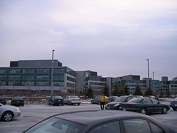
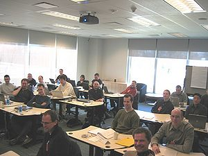
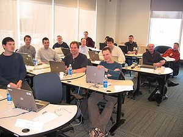

DSDP/TM/Toronto 23-Feb-2006 Photos
==================================

< [TM](./TM "DSDP/TM")

[Enlarge](./images/Toronto_Feb06_015.jpg)

Toronto IBM Labs

* * *

[Enlarge](./images/Toronto_Feb06_003.jpg)

IBM Meeting Room

  
Overview of the Meeting Room. A big Thank You to Pete Nicholls and IBM for hosting us perfecly well!

* * *

[Enlarge](./images/Toronto_Feb06_001_small.jpg)

Meeting Attendees, Left Side

  
Meeting Attendees - from left to right:

*   1st row - Ted Williams, Wind River
*   2nd row - Tom Hochstein, Freescale; John Cortell, Freescale; Felix Burton, WindRiver; Pawel Piech, WindRiver
*   3rd row - Ken Ryall, Nokia; Hobson Bullman, ARM; Kirk Beitz, Freescale
*   4th row - Alan Boxall, IBM; Samantha Chan, IBM; Pete Nicholls, IBM; Peter Lachner, Intel

[Load Full-scale Photo](./images/Toronto_Feb06_001.jpg "Toronto Feb06 001.jpg")

* * *

[Enlarge](./images/Toronto_Feb06_002_small.jpg)

Meeting Attendees, Right Side

  
Meeting Attendees - from left to right:

*   1st row - Paul Gingrich, TI; Martin Oberhuber, WindRiver; David Dykstal, IBM
*   2nd row - Javier Montalvo-Orus, Symbian; Neil Taylor, Symbian; Dave McKnight, IBM
*   3rd row - Doug Gaff, WindRiver; Darian Wong, Curtiss-Wright; Ewa Matejska, PalmSource
*   4th row - Mark Melvin, AMI; Ken Dyck, AMI; Aaron Spear, ATI/Mentor

[Load Full-scale Photo](./images/Toronto_Feb06_002.jpg "Toronto Feb06 002.jpg")

* * *

[Enlarge](./images/Toronto_Feb06_024.jpg)

Sunrise over Ontario

(Migrated from [https://wiki.eclipse.org/DSDP/TM/Toronto_23-Feb-2006_Photos](https://wiki.eclipse.org/DSDP/TM/Toronto_23-Feb-2006_Photos))